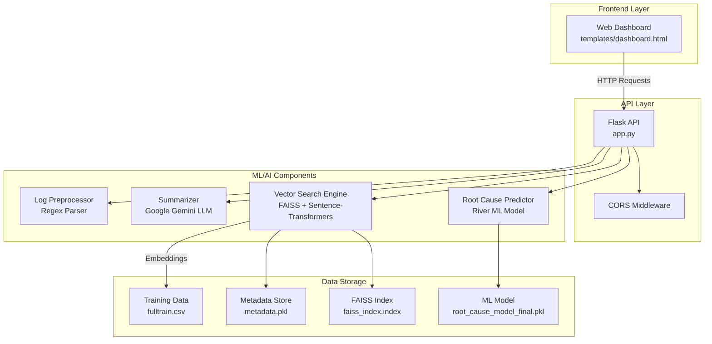
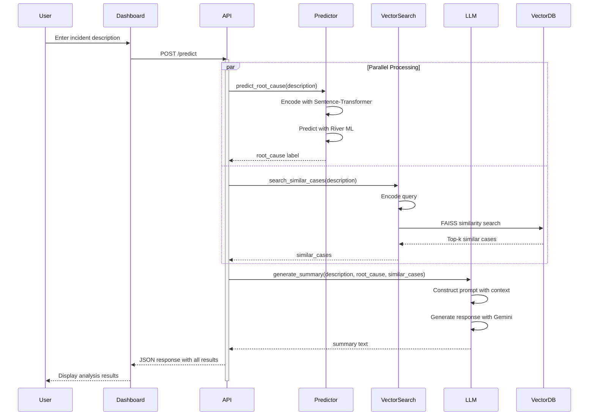
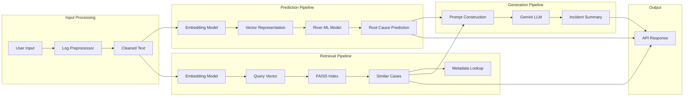

# Incident AI Agent
=======
#AI Powered- IT Incident Agent
**Intelligent Incident Management System Powered by AI**

An AI-powered incident analysis platform that combines machine learning, vector search, and large language models to automate root cause prediction, find similar historical cases, and generate actionable summaries for IT incidents.

---

## Table of Contents

- [Project Title & Overview](#project-title--overview)
- [Architecture Overview](#architecture-overview)
- [End-to-End Flow](#end-to-end-flow)
- [Component Interaction](#component-interaction)
- [RAG Pipeline — LLM Integration](#rag-pipeline--llm-integration)
- [Tech Stack](#tech-stack)
- [Project Structure](#project-structure)
- [Getting Started](#getting-started)
- [Configuration](#configuration)
- [API Reference](#api-reference)
- [Contributing](#contributing)
  

---

## Project Title & Overview

**Incident AI Agent** is a sophisticated incident management system designed to help IT teams analyze, categorize, and resolve incidents faster by leveraging artificial intelligence.

### Problem It Solves

IT incident management teams often face challenges in:
- Quickly identifying root causes of incidents
- Finding relevant historical cases for reference
- Generating comprehensive incident summaries
- Learning from past incidents to improve future responses

This system addresses these challenges by:
- **Automated Root Cause Prediction**: Uses online machine learning to predict incident categories
- **Intelligent Case Retrieval**: Leverages vector similarity search to find relevant historical incidents
- **AI-Powered Summarization**: Generates detailed incident summaries with actionable insights
- **Continuous Learning**: Incorporates user feedback to improve model accuracy

---

## Architecture Overview

The system follows a microservices-inspired architecture with distinct components for prediction, retrieval, and generation:



### High-Level Description

The architecture consists of four main layers:

1. **Frontend Layer**: A simple HTML-based dashboard that provides a user interface for interacting with the system
2. **API Layer**: Flask-based REST API that handles HTTP requests and routes them to appropriate components
3. **ML/AI Components**: Specialized modules for prediction, retrieval, and generation tasks
4. **Data Storage**: Persistent storage for models, vector indices, and metadata

The Flask API serves as the central orchestrator, coordinating between different AI components to provide comprehensive incident analysis.

---

## End-to-End Flow

### User Journey

1. **Input**: User submits an incident description through the web dashboard
2. **Processing**: The API receives the request and initiates parallel processing
3. **Prediction**: The ML model predicts the root cause category
4. **Retrieval**: Vector search finds similar historical incidents
5. **Generation**: LLM generates a comprehensive summary
6. **Response**: Results are returned to the dashboard for display

### Sequence Diagram



---

## Component Interaction

### Component Flowchart



### Data Flow

**Input → Output Transformations:**

1. **Raw Incident Description**
   - Input: Unstructured text describing an incident
   - Transformation: Text cleaning, tokenization (if logs), encoding
   - Output: Cleaned text and vector embeddings

2. **Root Cause Prediction**
   - Input: Vector embeddings (384 dimensions)
   - Transformation: River online learning model prediction
   - Output: Categorical label (12 possible root cause categories)

3. **Vector Search**
   - Input: Query vector embeddings
   - Transformation: FAISS L2 distance similarity search
   - Output: Top-k similar historical incidents with distances

4. **Summary Generation**
   - Input: Current incident, root cause, similar cases
   - Transformation: Prompt engineering + LLM inference
   - Output: Structured summary with actionable insights

---

## RAG Pipeline — LLM Integration

### RAG Architecture

This system implements a Retrieval-Augmented Generation (RAG) pipeline to enhance LLM responses with relevant historical context:

```mermaid
graph TB
    subgraph "Ingestion Phase"
        CSV[CSV Data<br/>fulltrain.csv] --> COMB[Combine Fields]
        COMB --> ENC[Encode with<br/>Sentence-Transformer]
        ENC --> EMB[Embeddings]
        EMB --> FAISS[Build FAISS Index]
        FAISS --> IDX[faiss_index.index]
        EMB --> META[Save Metadata]
        META --> PKL[metadata.pkl]
    end

    subgraph "Query Phase"
        QUERY[User Query] --> QENC[Encode Query]
        QENC --> QVEC[Query Vector]
        QVEC --> SEARCH[FAISS Search]
        SEARCH --> RETR[Retrieve Top-k]
        RETR --> CONTEXT[Build Context]
        PRED[Prediction] --> CONTEXT
        CONTEXT --> PROMPT[Construct Prompt]
        PROMPT --> LLM[Gemini LLM]
        LLM --> RESP[Generate Response]
    end
```



### Ingestion Phase

The ingestion phase processes historical incident data to build the vector index:

1. **Document Loading**: Reads incident data from `fulltrain.csv`
2. **Field Combination**: Merges "Description" and "Close notes" fields into combined text
3. **Chunking**: Each incident is treated as a single document (no chunking needed)
4. **Embedding**: Uses `sentence-transformers` (all-MiniLM-L6-v2) to generate 384-dimensional embeddings
5. **Indexing**: Builds FAISS IndexFlatL2 for efficient similarity search
6. **Storage**: Saves index to `faiss_index.index` and metadata to `metadata.pkl`

### Query Phase

The query phase retrieves relevant context for LLM generation:

1. **Query Embedding**: Encodes user query using the same sentence-transformer model
2. **Similarity Search**: Performs FAISS L2 distance search to find top-k similar incidents
3. **Context Retrieval**: Retrieves full ticket details (description, close notes, root cause) for similar cases
4. **Prompt Construction**: Builds a structured prompt with:
   - Current incident description
   - Predicted root cause
   - Similar historical cases with full context
5. **LLM Inference**: Sends prompt to Google Gemini (gemini-2.0-flash) for generation
6. **Response**: Returns structured summary with sections for summary, root cause, actions, resolution time, and confidence

### Models and Strategies

- **Embedding Model**: `all-MiniLM-L6-v2` (384 dimensions, optimized for semantic similarity)
- **LLM Model**: Google Gemini 2.0 Flash
- **Vector Database**: FAISS IndexFlatL2 (exact L2 distance search)
- **Retrieval Strategy**: Top-k similarity search (default k=5)
- **Prompt Engineering**: Structured prompt with clear sections and context formatting

---

## Tech Stack

| Category | Technology | Purpose |
|----------|-----------|---------|
| **Backend Framework** | Flask | REST API server and request handling |
| **Backend Framework** | Flask-CORS | Cross-origin resource sharing support |
| **Machine Learning** | River | Online learning for root cause prediction |
| **Machine Learning** | sentence-transformers | Text embeddings for semantic similarity |
| **Vector Database** | FAISS | High-performance similarity search |
| **LLM** | Google Gemini | AI-powered summarization and generation |
| **Data Processing** | pandas | Data manipulation and CSV handling |
| **Data Processing** | numpy | Numerical operations and array handling |
| **Data Processing** | pickle | Model and metadata serialization |
| **Frontend** | HTML/CSS/JavaScript | Web dashboard interface |
| **Text Processing** | regex (re) | Log parsing and preprocessing |

---

## Project Structure

```
incident_ai_agent/
├── app.py                      # Flask API application and endpoints
├── requirements.txt            # Python dependencies
├── README.md                   # Project documentation
├── faiss_index.index          # FAISS vector index (built from data)
├── metadata.pkl               # Metadata for vector search results
├── fulltrain.csv              # Training data for vector index
├── summarize_payload.json     # Sample payload for summarization
│
├── models/                     # Machine learning models
│   ├── __init__.py
│   ├── root_cause_function.py # Root cause prediction with River ML
│   ├── root_cause_model.pkl   # Trained River model (empty/backup)
│   ├── root_cause_model_final.pkl # Production River model
│   └── summarizer.py          # LLM-based summarization with Gemini
│
├── utils/                      # Utility functions
│   ├── __init__.py
│   ├── preprocessor.py        # Log preprocessing and parsing
│   └── vector_utils.py        # Vector utility functions (empty)
│
├── vector_store/              # Vector database components
│   ├── __init__.py
│   ├── build_faiss_index.py   # Script to build FAISS index from CSV
│   ├── vector_search.py       # Vector similarity search functions
│   ├── embeddings.pkl         # Cached embeddings (empty)
│   └── fulltrain.csv          # Incident data for indexing
│
├── templates/                  # HTML templates
│   └── dashboard.html         # Web dashboard interface
│
├── incident_env/             # Virtual environment (Python dependencies)
└── .venv/                    # Alternative virtual environment
```

---

## Getting Started

### Prerequisites

- **Python**: 3.8 or higher
- **Google Gemini API Key**: Required for summarization feature
- **pip**: Python package manager

### Installation

1. **Clone the repository**
   ```bash
   git clone <repository-url>
   cd incident_ai_agent
   ```

2. **Create virtual environment** (recommended)
   ```bash
   python -m venv venv
   # On Windows
   venv\Scripts\activate
   # On Unix/MacOS
   source venv/bin/activate
   ```

3. **Install dependencies**
   ```bash
   pip install -r requirements.txt
   ```

4. **Install additional dependencies** (if not in requirements.txt)
   ```bash
   pip install flask flask-cors river sentence-transformers faiss-cpu google-generativeai
   ```

### Running the Ingestion Pipeline

To build or rebuild the vector index from historical data:

```bash
cd vector_store
python build_faiss_index.py
```

This will:
- Read incident data from `fulltrain.csv`
- Generate embeddings using sentence-transformers
- Build FAISS index
- Save index to `faiss_index.index` and metadata to `metadata.pkl`

### Running the Application

1. **Start the Flask server**
   ```bash
   python app.py
   ```

2. **Access the dashboard**
   - Open browser and navigate to: `http://localhost:5001`
   - The dashboard provides three main features:
     - Predict Root Cause (with summary generation)
     - Search Similar Cases
     - Preprocess Logs

3. **API is ready** at `http://localhost:5001` with endpoints documented below

---

## Configuration

### Key Configurable Parameters

| Parameter | Location | Default | Description |
|-----------|----------|---------|-------------|
| **Server Port** | `app.py` line 124 | 5001 | Flask server port |
| **Top-k Retrieval** | `vector_store/vector_search.py` line 22 | 5 | Number of similar cases to retrieve |
| **Embedding Model** | `vector_store/vector_search.py` line 20 | all-MiniLM-L6-v2 | Sentence transformer model |
| **LLM Model** | `models/summarizer.py` line 7 | gemini-2.0-flash | Google Gemini model |
| **Root Cause Labels** | `models/root_cause_function.py` lines 7-16 | 12 categories | Classification labels |
| **Debug Mode** | `app.py` line 124 | True | Flask debug mode |

### Modifying Configuration

**Change Server Port:**
```python
# In app.py, line 124
app.run(debug=True, port=5000)  # Change to desired port
```

**Change Top-k Retrieval:**
```python
# In vector_store/vector_search.py, line 22
def search_similar_cases(user_input, top_k=10):  # Change from 5 to 10
```

**Change Embedding Model:**
```python
# In vector_store/vector_search.py, line 20
model = SentenceTransformer("all-mpnet-base-v2")  # Change to different model
```

**Change LLM Model:**
```python
# In models/summarizer.py, line 7
model = genai.GenerativeModel('gemini-pro')  # Change to different Gemini model
```

---

## API Reference

### Base URL
```
http://localhost:5001
```

### Endpoints

#### 1. GET `/`
**Description**: Serve the web dashboard

**Response**: HTML dashboard interface

**Example**:
```bash
curl http://localhost:5001/
```

---

#### 2. POST `/preprocess_logs`
**Description**: Preprocess raw log data into structured format

**Request Body** (JSON):
```json
{
  "logs": "[ERROR] 2024-01-15 10:30:45 Connection timeout to database\n[INFO] 2024-01-15 10:30:46 Retrying connection"
}
```

**Response** (JSON):
```json
{
  "processed_logs": "[ERROR] 2024-01-15 10:30:45 - Connection timeout to database\n[INFO] 2024-01-15 10:30:46 - Retrying connection"
}
```

**Example**:
```bash
curl -X POST http://localhost:5001/preprocess_logs \
  -H "Content-Type: application/json" \
  -d '{"logs": "[ERROR] 2024-01-15 10:30:45 Connection timeout"}'
```

---

#### 3. POST `/predict`
**Description**: Predict root cause, find similar cases, and generate summary

**Request Body** (JSON):
```json
{
  "description": "Application is not responding after database connection timeout"
}
```

**Response** (JSON):
```json
{
  "root_cause": "Network Connectivity & Performance Issues",
  "summary": "## SUMMARY\nDatabase connection timeout causing application unresponsiveness...\n\n## LIKELY ROOT CAUSE\nNetwork connectivity issue between application and database...\n\n## IMMEDIATE ACTIONS\n1. Check database server status\n2. Verify network connectivity\n3. Review database connection pool configuration\n\n## EXPECTED RESOLUTION TIME\n1-2 hours based on similar incidents\n\n## CONFIDENCE LEVEL\nHigh",
  "similar_cases": [
    {
      "rank": 1,
      "distance": 0.85,
      "ticket": {
        "Description": "Gateway timeout in backoffice",
        "Close notes": "RCA: Database connection pool exhaustion...",
        "root_cause": "Order Management Issues"
      }
    }
  ]
}
```

**Example**:
```bash
curl -X POST http://localhost:5001/predict \
  -H "Content-Type: application/json" \
  -d '{"description": "Application not responding after database timeout"}'
```

---

#### 4. POST `/search`
**Description**: Search for similar historical incidents

**Request Body** (JSON):
```json
{
  "query": "database connection timeout"
}
```

**Response** (JSON):
```json
[
  {
    "rank": 1,
    "distance": 0.85,
    "ticket": {
      "Description": "Gateway timeout in backoffice",
      "Close notes": "RCA: Database connection pool exhaustion",
      "root_cause": "Order Management Issues"
    }
  }
]
```

**Example**:
```bash
curl -X POST http://localhost:5001/search \
  -H "Content-Type: application/json" \
  -d '{"query": "database connection timeout"}'
```

---

#### 5. POST `/summarize`
**Description**: Generate summary from query and similar cases

**Request Body** (JSON):
```json
{
  "query": "Application not responding",
  "similar_cases": [
    {
      "ticket": {
        "Description": "Gateway timeout",
        "Close notes": "Database issue",
        "root_cause": "Network Issues"
      }
    }
  ]
}
```

**Response** (JSON):
```json
{
  "summary": "## SUMMARY\nApplication unresponsiveness due to network issues...\n\n## LIKELY ROOT CAUSE\nNetwork connectivity problems...\n\n## IMMEDIATE ACTIONS\n1. Check network status\n2. Verify connectivity\n3. Review logs\n\n## EXPECTED RESOLUTION TIME\n1-2 hours\n\n## CONFIDENCE LEVEL\nMedium"
}
```

**Example**:
```bash
curl -X POST http://localhost:5001/summarize \
  -H "Content-Type: application/json" \
  -d '{"query": "Application not responding", "similar_cases": [...]}'
```

---

#### 6. POST `/feedback`
**Description**: Update model with user feedback on incorrect predictions

**Request Body** (JSON):
```json
{
  "description": "Application not responding after database timeout",
  "predicted": "Miscellaneous/Uncategorized",
  "true_label": "Network Connectivity & Performance Issues"
}
```

**Response** (JSON):
```json
{
  "message": "Model updated with user feedback",
  "new_prediction": "Network Connectivity & Performance Issues",
  "true_label_used": "Network Connectivity & Performance Issues"
}
```

**Example**:
```bash
curl -X POST http://localhost:5001/feedback \
  -H "Content-Type: application/json" \
  -d '{"description": "...", "predicted": "...", "true_label": "..."}'
```

---

## Contributing

Contributions are welcome! Please follow these guidelines:

1. **Fork the repository**
2. **Create a feature branch**: `git checkout -b feature/amazing-feature`
3. **Make your changes** with clear commit messages
4. **Test thoroughly**:
   - Ensure all API endpoints work correctly
   - Test with various input scenarios
   - Verify ML model predictions
5. **Submit a pull request** with a description of your changes

### Development Guidelines

- Follow PEP 8 for Python code style
- Add docstrings to new functions
- Update documentation for new features
- Test changes before submitting PRs
- Keep dependencies updated in `requirements.txt`


### Future Enhancements

- Add authentication and authorization
- Implement batch processing for multiple incidents
- Add support for additional LLM providers
- Improve UI with more visualization features
- Add monitoring and logging
- Implement model versioning
- Add unit and integration tests

### Support

For issues, questions, or contributions, please refer to the project repository or contact the maintainers.

---

**Built with ❤️ for IT incident management teams**
